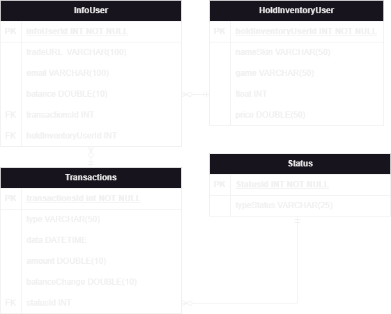
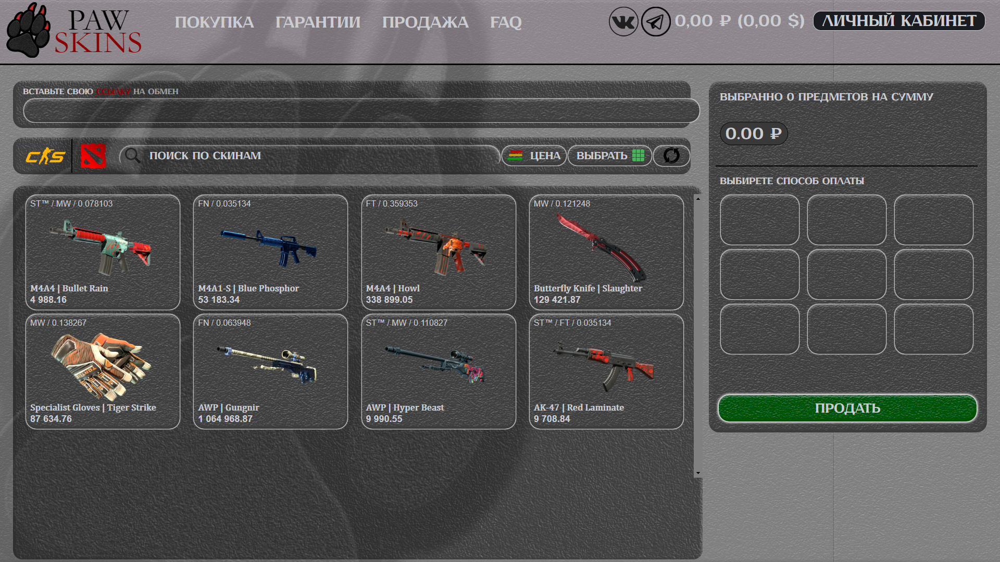
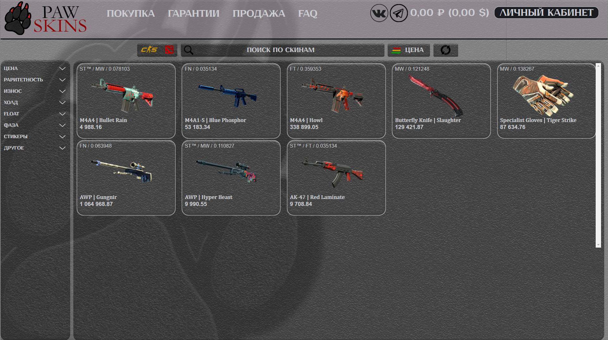
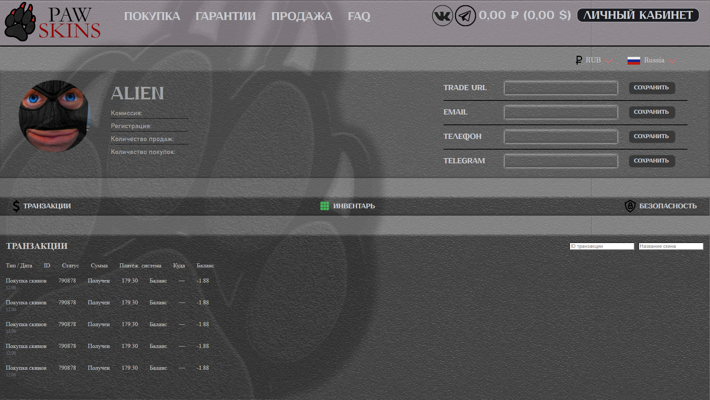

<table style="width: 100%;">
  <tr>
    <td style="text-align: center; border: none;"> 
      Министерство образования и науки РФ  
      ГБПОУ РМЭ "Йошкар-Олинский Технологический колледж 
    </td>
  </tr>
  <tr>
    <td style="text-align: center; border: none; height: 15em;">
      <h2>
        Курс лекций по предмету  
        "Основы алгоримизации и программирования"  
        для группы И-41
      </h2>
    </td>
  </tr>
  <tr>
    <td style="text-align: right; border: none; height: 20em;">
      

        <b>Разработал</b>:  
        Ялтаев Глеб Владимирович
      

    </td>
  </tr>
  <tr>
    <td style="text-align: center; border: none; height: 5em;">
      г.Йошкар-Ола, 2025
    </td>
  </tr>
</table>

# "ERD"

# "БД по ERD"

# "User-Story"

# "Диаграмма прецендентов"

## "Сайт"

<table style="width: 100%;">
    <tr>
        <td style=" font-size: 30px;">
        P.S: Сам дизайн сайта находиться на стадии разработки он ещё не готов и не интегрирован в проект, поэтому здесь и можно увидеть его старую, кривую версию.
        </td>
    </tr>
    <tr>
        <td style=" font-size: 30px;">
        P.S: База данных пока не подключена т.к. ведёться работы по подключению "SteamAPI", только после подключения к SteamAPI можно будет подвязывать информацию с базы данных к Steam-профилю пользователя.
        </td>
    </tr>
    <tr>
        <td style=" font-size: 30px;">
        Прошу отнестись с пониманием к данному проекту ведь всё впереди.
        </td>
    </tr>
</table>